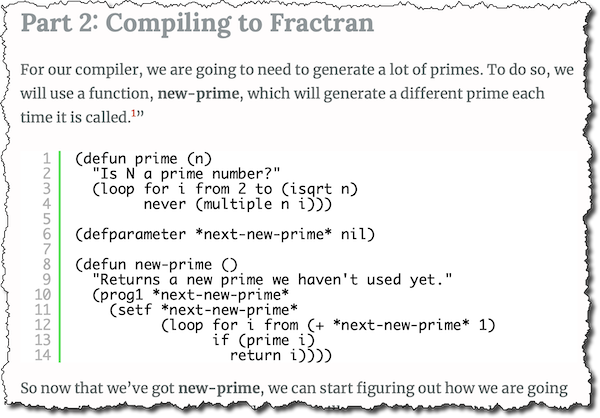

# FRACTRAN


A FRACTRAN interpreter, in honour of [John Horton Conway](https://www.math.princeton.edu/people/john-conway).

### setup and running the examples

Prerequisites:

- A recent-ish installaction of node.
- Babel (if you prefer) https://babeljs.io/docs/en/usage

Installing Babel to compile ES-whatever to node-whatever:

```bash
npm install --save-dev @babel/core @babel/cli @babel/preset-env
npm install --save @babel/polyfill
```

And then to run a program, e.g. to print the first three primes using a naïve integer implementation:

```bash
npx babel src --out-dir lib && node ./lib/naive-primes.js 3
  => 2
     3
     5
```

Or to print a potentially infinite list of primes using a big integer implementation:

```bash
npx babel src --out-dir lib && node ./lib/big-int-primes.js
  => 2
     3
     5
     7
     11
     13
     17
     19
     23
     29
     ...
```

Or to compute an arbitrary fibonacci number:

```bash
npx babel src --out-dir lib && node ./lib/big-int-primes.js 7
  => fib(7) = 13
```

## More...

[](https://malisper.me/building-fizzbuzz-fractran-bottom/)

[](http://raganwald.com/hashlife/)

[](https://github.com/raganwald/cafeaulife)

